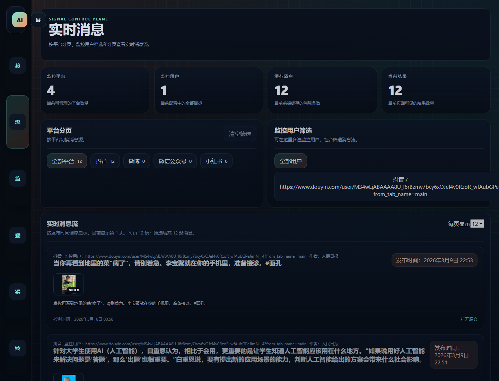
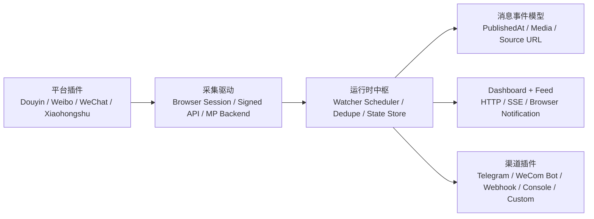

# Social Signal Control Plane

面向中文内容平台的插件化监控与推送中枢。项目聚焦于“监控最新发布内容 -> 统一聚合 -> 多渠道实时分发”，当前默认覆盖抖音、微博、微信公众号、小红书，并提供浏览器端 Dashboard、SSE 实时流、Telegram、企业微信机器人、Webhook 等推送能力。



## 项目定位

`Social Signal Control Plane` 不是单一平台爬虫，而是一套可扩展的消息情报工作台：

- 平台侧采用插件化设计，可继续扩展新的内容源
- 渠道侧采用模块化设计，可继续扩展新的推送方式
- 支持在页面中维护监控用户、登录状态、通知渠道
- 监控发现后的进程内分发延迟预算可压到毫秒级
- UI 同时提供管理视角和实时消息流视角，适合内容运营、舆情观察、情报汇总场景

## 核心能力

- 平台插件：抖音、微博、微信公众号、小红书
- 实时消息流：按发布时间倒序展示，支持平台分页、用户筛选
- 登录管理：需要登录的平台会在页面中展示状态，并支持点击发起登录
- 通知能力：浏览器通知、SSE、Telegram、企业微信机器人、Webhook、Console
- 热更新配置：支持在页面中动态添加、编辑、删除监控目标
- 去重与新消息基线：默认不回灌旧内容，只保留监控启动后新发现的内容

## 页面预览

- 左侧导航：功能页切换、菜单折叠
- Dashboard：全局状态、监控规模、登录状态、告警信息
- Feed：实时消息流、平台筛选、用户筛选、缩略图、发布时间
- Targets / Auth / Channels：监控目标维护、登录态维护、通知渠道维护

## 架构概览



## 默认平台支持

| 平台 | 采集方式 | 是否需要登录 | 当前状态 |
| --- | --- | --- | --- |
| 抖音 | 浏览器登录态 + 作品接口 | 是 | 已接入 |
| 微博 | 浏览器登录态 + 页面同源接口 | 是 | 已接入 |
| 微信公众号 | `mp.weixin.qq.com` 登录态 + 后台接口 | 是 | 已接入 |
| 小红书 | 浏览器登录态 + 页面签名接口 | 是 | 已接入 |

## 默认推送渠道

| 渠道 | 说明 |
| --- | --- |
| Browser SSE | 本地页面实时消息流 |
| Browser Notification | 浏览器原生通知弹窗 |
| 微信（OpenClaw） | 通过 OpenClaw Gateway + 腾讯微信插件发送到微信 |
| Telegram | 通过 Bot 推送到指定会话 |
| WeCom Bot | 通过企业微信群机器人 Webhook 推送到群聊 |
| WeCom Smart Bot | 通过企业微信智能机器人长连接主动推送到单聊或群聊 |
| Webhook | 推送到任意 HTTP 接收端 |
| Console | 本地终端日志输出 |

## 快速启动

### 1. 安装依赖

```bash
npm install
```

### 2. 启动服务

```bash
npm start
```

启动后访问：

- `http://127.0.0.1:3030`
- `http://127.0.0.1:3030/health`

### 3. 单次采集

```bash
node src/index.js --once
```

## 登录命令

```bash
npm run auth:douyin
npm run auth:weibo
npm run auth:wechat
npm run auth:xiaohongshu
```

说明：

- 项目不会提交任何真实登录态文件
- 浏览器登录态默认保存在 `data/browser/*.storage-state.json`
- 这些文件已经加入 `.gitignore`

## 本地登录代理

服务器侧的远程扫码登录已经移除。现在推荐的登录方式是：

1. 服务器负责创建登录任务
2. 你本机运行 `local auth agent`
3. agent 在你的电脑上自动打开真实浏览器完成登录
4. 登录成功后，agent 自动把 `storage-state` 上传回服务器

这样做的原因很直接：

- 抖音、小红书、公众号这类站点对机房 IP、无头浏览器、远程截图工作台的风控更重
- 网页本身不能直接执行你电脑上的本地脚本，这是浏览器安全模型决定的
- 用本地 agent 领取任务，成功率更高，也不需要你手动上传登录态文件

### 服务端启用

服务器环境变量需要设置：

```bash
NEWS_LOCAL_AUTH_TOKEN=your-random-token
```

### 本机启动 agent

```bash
npm run auth:agent -- --server https://your-domain.example --token your-random-token
```

当前仓库里对应脚本是：

- [scripts/local-auth-agent.js](scripts/local-auth-agent.js)
- [scripts/lib/run-platform-login.js](scripts/lib/run-platform-login.js)

### 使用流程

1. 先在你自己的电脑上启动 `local auth agent`
2. 打开项目页面的“平台登录”
3. 点击目标平台“开始登录”
4. 本地 agent 会自动领取任务并打开浏览器
5. 登录成功后，登录态自动写回服务器

### 任务自动释放

如果你点击了“开始登录”，但本地 agent 没有在短时间内领取任务，任务会自动失效并释放。当前默认释放窗口是 `20 秒`。这意味着：

- 如果本地 agent 没启动，不会把按钮永久卡死
- 等待约 `20 秒` 后，你可以再次点击重新创建任务
- 页面 Dashboard 里也会直接提示 agent 是否在线

## 浏览器后台通知

项目现在支持 `Web Push + Service Worker`。这和原来的“页面开着时用 SSE 调用 `Notification`”不是一回事。

启用后：

- 页面开着时，实时消息仍然会正常刷新
- 页面关闭后，只要浏览器进程还在，仍然可以收到系统通知
- 推送订阅保存在服务器运行态中，服务端发现新消息后会直接推送到浏览器

实现文件：

- [src/core/web-push-manager.js](src/core/web-push-manager.js)
- [src/core/web-push-sw.js](src/core/web-push-sw.js)

说明：

- `Web Push` 需要 `HTTPS` 或 `localhost`
- 第一次启用时，前端会自动注册 `Service Worker`
- 如果当前页面可见，Service Worker 会尽量不重复弹通知，避免和前台页面提醒重复

## 配置说明

主配置文件位于 [config/default.config.js](config/default.config.js)。

重点配置项：

- `platforms.<platform>.targets`
  - 平台默认监控用户列表
- `platforms.<platform>.source.type`
  - 平台采集驱动类型
- `channels`
  - 推送渠道开关与参数
- `channels.wecom-bot`
  - 企业微信机器人配置，支持 `webhookKey` 或 `webhookUrl`
- `channels.wecom-smart-bot`
  - 企业微信智能机器人配置，支持 `botId + secret + chatIds`
- `runtime.externalPlugins`
  - 外部插件加载入口
- `runtime.browser`
  - 浏览器采集参数

企业微信渠道环境变量示例：

```bash
NEWS_WECOM_BOT_WEBHOOK_KEY=your-wecom-bot-key
NEWS_WECOM_BOT_MESSAGE_TYPE=markdown
NEWS_WECOM_BOT_MENTIONED_MOBILE_LIST=
NEWS_WECOM_BOT_MENTIONED_LIST=
NEWS_OPENCLAW_BIN=openclaw
NEWS_OPENCLAW_WEIXIN_CHANNEL=openclaw-weixin
NEWS_OPENCLAW_WEIXIN_TARGET=wxid_xxx
NEWS_OPENCLAW_WEIXIN_ACCOUNT_ID=
NEWS_WECOM_SMART_BOT_BOT_ID=your-smart-bot-id
NEWS_WECOM_SMART_BOT_SECRET=your-smart-bot-secret
NEWS_WECOM_SMART_BOT_CHAT_IDS=userid_or_chatid_1,userid_or_chatid_2
NEWS_WECOM_SMART_BOT_MESSAGE_TYPE=markdown
```

说明：

- 这里需要的是企业微信群机器人的 `Webhook Key`，也就是 Webhook 地址里 `key=` 后面的那段字符串
- 也可以直接填写完整的 `Webhook URL`
- `机器人 ID`、`企业 ID`、`AgentId` 不能直接用于群机器人推送
- `WeCom Smart Bot` 是另一条独立通道，使用企业微信智能机器人的 `BotID + Secret` 建立长连接
- `NEWS_WECOM_SMART_BOT_CHAT_IDS` 支持多个会话 ID；单聊填写用户 `userid`，群聊填写对应 `chatid`
- 项目会在机器人收到消息或事件后，自动记录最近发现的 `userid / chatid`，可在页面“通知渠道”里直接复制或填入
- `微信（OpenClaw）` 不是直接调用微信官方 SDK，而是调用本机或服务器上的 `openclaw message send`

## 微信（OpenClaw）接入

你提供的这条命令：

```bash
npx -y @tencent-weixin/openclaw-weixin-cli@latest install
```

本质上做的是：

1. 检查本机是否已经安装 `openclaw`
2. 安装 `@tencent-weixin/openclaw-weixin`
3. 执行 `openclaw channels login --channel openclaw-weixin`
4. 重启 `openclaw gateway`

所以它不是直接给本项目调用的微信 SDK，而是一个 **OpenClaw 微信桥接器**。当前项目已经新增了 `openclaw-weixin` 通知渠道，发送时会执行：

```bash
openclaw message send --channel openclaw-weixin --target <target> --message "<消息内容>"
```

### 前置步骤

先在要发送微信消息的那台机器上完成：

```bash
npm install -g openclaw
npx -y @tencent-weixin/openclaw-weixin-cli@latest install
```

完成扫码登录后，再在项目里新增“微信（OpenClaw）”渠道，并填写：

- `Target`
  OpenClaw 识别到的微信目标 ID
- `Account ID`
  可选，多微信账号时用于指定账号
- `OpenClaw 命令`
  默认 `openclaw`
- `渠道 ID`
  默认 `openclaw-weixin`

## 真实时效说明

项目默认将 `runtime.latencyBudgetMs = 10` 解释为：

- 监控进程在“发现新内容之后”完成内部事件分发的预算

这不等于互联网端到端送达必定 `1-10ms`。真实到达时间取决于：

- 平台是否提供及时可见的页面或接口数据
- 轮询周期
- 浏览器加载和风控验证
- 外部通知渠道网络状况

当前工程能力是：

- 尽快检测到平台新增内容
- 检测到后立刻进入本地页面流和通知渠道
- 默认不回灌旧消息，只推送运行期间新发现的消息

## 项目结构

```text
src/
  app/          应用装配
  channels/     推送渠道插件
  core/         运行时、HTTP、SSE、状态管理
  platforms/    平台插件与采集驱动
config/
  default.config.js
scripts/
  平台登录、辅助工具
test/
  运行时与接口测试
```

## 自定义扩展

- 新平台：参考 `src/platforms`
- 新通知渠道：参考 `src/channels`
- 外部插件：通过 `runtime.externalPlugins` 动态挂载

示例见：

- [examples/custom-plugins/slack-webhook.js](examples/custom-plugins/slack-webhook.js)

## 开发与测试

```bash
npm test
```

## 公开仓库说明

出于安全与可复用性考虑，公开仓库中不会包含：

- 任何真实浏览器登录态
- 运行时用户目标状态文件
- 本地日志
- 临时截图与验证产物

如果你打算在自己的环境中直接运行，请先完成对应平台登录，再从页面中添加你自己的监控目标。

## License

[MIT](LICENSE)
